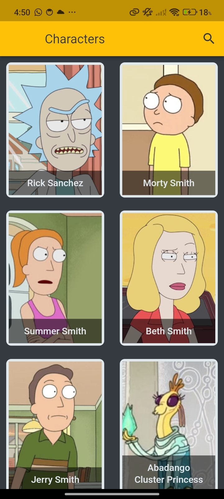
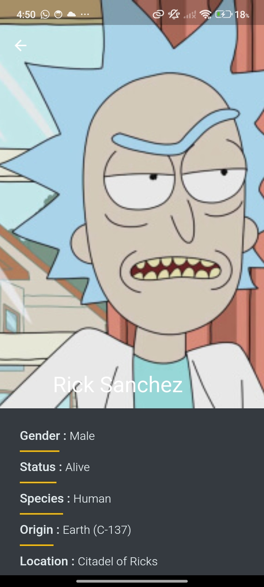
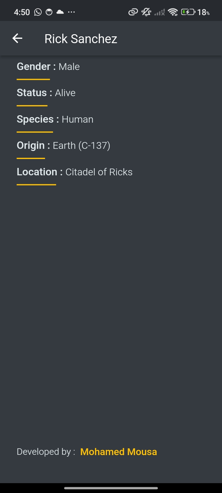
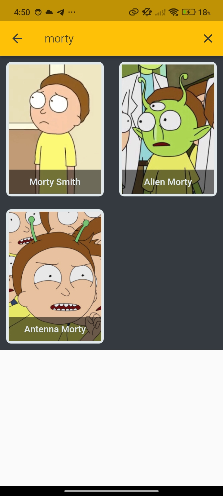

# Rick and Morty Flutter App 📱

🎯 The **"Rick and Morty"** Flutter app is a *comprehensive collection of characters from the beloved animated TV show* **"Rick and Morty"** This app, built using **Flutter**, utilizes various packages to provide an immersive and feature-rich experience to fans.

🎯 The app employs the **Bloc** state management pattern, specifically using **Cubit**, to efficiently manage the application state and ensure a smooth user experience. With **Cubit**, the app maintains a clean and organized codebase, making it easier to handle complex UI interactions and data flow.

🎯 To connect with the "Rick and Morty" API and retrieve character information, the app integrates the **Dio package**. **Dio** simplifies the process of making HTTP requests, allowing seamless communication between the app and the API endpoints.

🎯 Ensuring a seamless user experience even in offline scenarios, the app incorporates the **flutter_offline package**. This package provides a straightforward way to monitor the device's internet connection status, enabling the app to gracefully handle offline scenarios and provide cached data when necessary.

🎯 With the **flutter_screenutil package**, the app achieves responsive and adaptive UI design. It allows the app's layout to adjust dynamically based on different screen sizes and resolutions, ensuring consistent and visually appealing user interfaces across various devices.

🎯 Additionally, the app utilizes the **url_launcher package**, enabling users to launch external URLs directly from the app. This functionality provides a convenient way for users to access additional resources related to the characters, such as official websites, social media profiles, or merchandise stores.

### 🎥 Demo

[Click to watch the demo](https://www.linkedin.com/posts/mohamed-mousa-b1946a24a_flutter-flutterdev-fluttercommunity-activity-7107362254806753281-1h_i?utm_source=share&utm_medium=member_desktop&rcm=ACoAAD2l_8UBkpejvCs4ysZXKCYHBIQ_0xljbRY)

#### 🖼️ Screenshots

  
  
  
  

